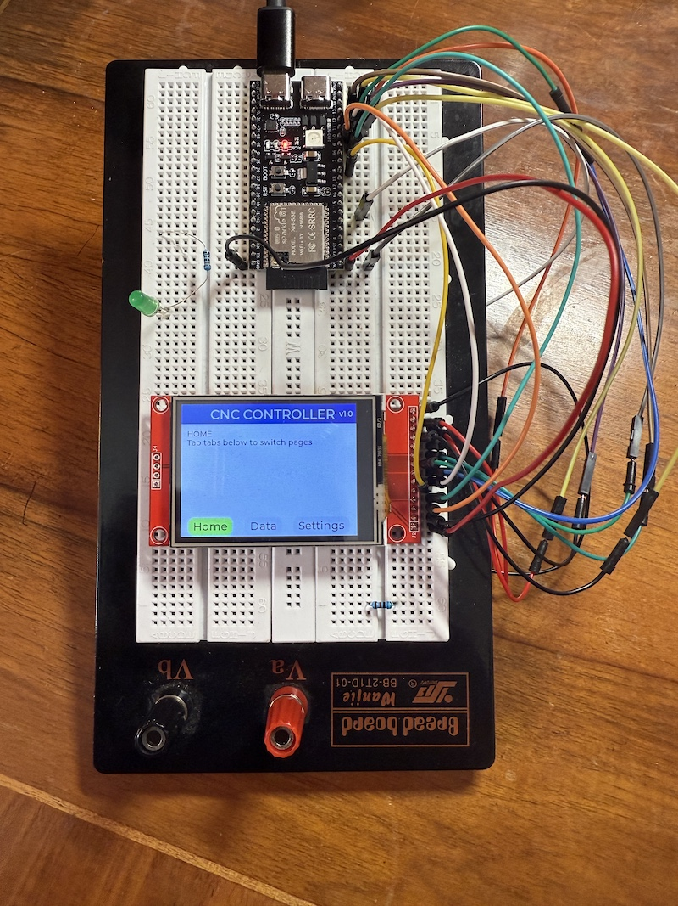
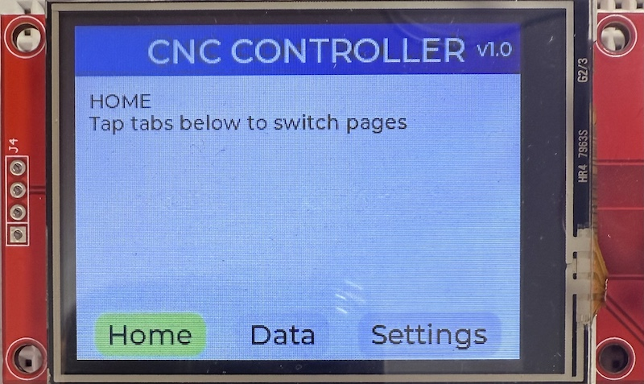
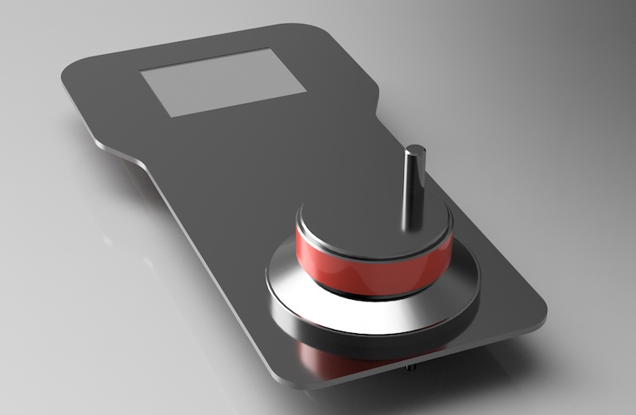

# CNC Controller GUI

> 🚧 **Work in Progress:** Hardware layout, firmware features, and UI visuals are evolving rapidly. Expect breaking changes and rough edges.

ESP32-S3 powered touchscreen interface for my wireless CNC controller project. The firmware is built with PlatformIO, the Arduino framework, the TFT_eSPI driver, and LVGL for UI composition.
Developed on ESP32-S3-DevKitC-1 with integrated USB and WiFi capabilities for seamless development and wireless communication.

## Features

- 320x240 ILI9341 display with LVGL-driven tabbed interface
- Responsive touch handling (XPT2046)
- Multiple input devices (can be connected or emulated)
  - Rotary encoder
  - Switch selector
  - Momentary push buttons
- ESP-NOW wireless communication for real-time CNC data exchange
- Bidirectional command/status protocol with automatic device pairing
  - Receiver acts as a HID keyboard device (not in this repo)
- PlatformIO multi-environment setup (main firmware + touch calibration)

## Repository Layout

```text
CNC Controller/
├── include/             # Headers shared across components
├── lib/                 # Optional PlatformIO libraries
├── src/                 # Application sources (GUI, communication, input devices)
├── touch_calibration/   # Calibration sketch used for TFT_eSPI touch setup
├── platformio.ini       # Environment configuration
└── README.md

```

## Hardware Gallery


*Breadboard setup*
<br><br>


*Touch display closeup*
<br><br>


*Intended use: Wireless CNC controller front plate*
<br><br>

## PlatformIO Configuration

1. Install [PlatformIO](https://platformio.org/install/ide?install=vscode) for VS Code.
2. Clone the repository and open the workspace folder `CNC Controller` in VS Code.
3. Use the **PlatformIO** sidebar to build or upload the `esp32-s3-devkitc-1` environment.
4. For touch calibration, run the `touch-calibration` environment by modifying `platformio.ini`:

    ```ini
    [platformio]
    ; default_envs = esp32-s3-devkitc-1
    ; src_dir = src
    default_envs = touch-calibration
    src_dir = touch_calibration
    ```

    Comment/uncomment the appropriate lines to switch between environments.

5. The project requires specific adjustments to match the wiring and GPIO pins used (for more information see the [TFT_eSPI wiki](https://github.com/Bodmer/TFT_eSPI/wiki/Installing-on-PlatformIO)).

    Key settings in `platformio.ini` (adjust to your needs):

    ```ini
    [env]
    monitor_speed = 115200
    lib_deps =
    bodmer/TFT_eSPI@^2.5.43
    <https://github.com/PaulStoffregen/XPT2046_Touchscreen.git>
    lvgl/lvgl@^9.3.0
    build_flags =
    -D USER_SETUP_LOADED=1
    -I include
    -D ILI9341_DRIVER=1                           ; Select ILI9341 driver
    -D TFT_WIDTH=240                              ; Set TFT size
    -D TFT_HEIGHT=320
    -D SCREEN_WIDTH=TFT_HEIGHT                    ; Set screen size as used in landscape
    -D SCREEN_HEIGHT=TFT_WIDTH
    -D TFT_MISO=13                                ; Define SPI pins
    -D TFT_MOSI=11
    -D TFT_SCLK=12
    -D TFT_CS=10
    -D TFT_DC=8                                   ; Data/Comand pin
    -D TFT_RST=9                                  ; Reset pin
    -D TOUCH_CS=14                                ; Define touch pins
    -D TOUCH_IRQ=7                                ; Not used
    -D TOUCH_XPT2046=1                            ; XPT2046 touch controller
    -D LOAD_GLCD=1                                ; Load Fonts
    -D SMOOTH_FONT=1
    -D SPI_FREQUENCY=40000000                     ; Set SPI frequency
    ```

### Touch Interface Wiring

The touch controller shares SPI pins with the TFT display. Both controllers share the SPI data and clock lines:

- **T_DO** (touch data out) connects to **TFT_MISO** (pin 13)
- **T_DIN** (touch data in) connects to **TFT_MOSI** (pin 11)
- **T_SCK** (touch clock) connects to **TFT_SCLK** (pin 12)

This shared SPI configuration allows both the display and touch controller to communicate over the same bus using separate chip select pins. The three touch pins mentioned above are only relevant for physical wiring - they share the same ESP32 pins as the display's SPI connections.

### TFT_eSPI Library Fix

- **`esp32-s3-devkitc-1/TFT_eSPI/Processors/TFT_eSPI_ESP32_S3.h`**

    Add the following line before `#ifndef REG_SPI_BASE ...` to prevent execution corruption (that fix may not be permanently needed as the libs will be further developed):

    ```c
    #undef REG_SPI_BASE
    ```

> **Note:** These modifications are applied to the PlatformIO library dependencies and need to be reapplied if the libraries are updated.

> **Note:** For more information, see this [thread](https://github.com/Bodmer/TFT_eSPI/issues/3743). This issue also affects the version I am using (TFT_eSPI v2.5.43).

## License

This project is licensed under the [MIT License](LICENSE).
